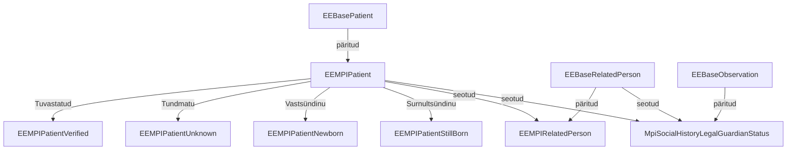

Patsiendi üldandmete teenus (PÜT) põhineb EEBase EEBasePatient, EEBaseRelatedPerson ja EEBaseObservation profiilidel.
Kasutame juurutusjuhendis teenuse kirjeldamiseks termineid "PÜT - patsiendi üldandmete teenus" ja "MPI - Master Patient Index", kuid peame nende all silmas sisuliselt sama teenust.

Väljavõte EE MPI profiilide sõltuvusgraafist:

## EEMPIPatient
Profiilid on vajalikud andmekoosseisude valideerimiseks. Selle eesmärgiga profiilid luuakse iga kasutusjuhu jaoks eraldi ja välditakse liiga üldiste profiilide kasutamist.

[EE MPI Patient](StructureDefinition-ee-mpi-patient.html) on abstractne profiil, mille eesmärk kirjeldada üldised MPI piirangud.

Nii võrreldes EEBase-iga MPI ei toeta: *maritalStatus*, *photo*, *contact*, *generalPractitioner*, *managingOrganization*	ja *link* elemente sisendina ja ei töötle neid kui neid edastatakse teenusele.
Samas teenus pakkub patsiente [sidumise ja lahti sidumise](link.html) tegevusi ning sidumise tulemusi väljastab *link* elemendis.

Kasutusjuhu põhised patsiendi profiilid on 

| Profiil  | Kasutusjuht |
|---|---|
| [EEMPIPatientVerified](StructureDefinition-ee-mpi-patient-verified.html) | Dokumendi alusel tuvastatud patsiendi registreerimine |
| [EEMPIPatientUnknown](StructureDefinition-ee-mpi-patient-unknown.html) | Tundmatu või anaonüümse patsiendi registreerimine |
| [EEMPIPatientNewborn](StructureDefinition-ee-mpi-patient-newborn.html) | Vastsündinu patsiendi registreerimine (antud profiil realiseeritakse tulevikus) |
| [EEMPIPatientStillborn](StructureDefinition-ee-mpi-patient-stillborn.html) | Surnultsündini patsiendi registreerimine (antud profiil realiseeritakse tulevikus) |

